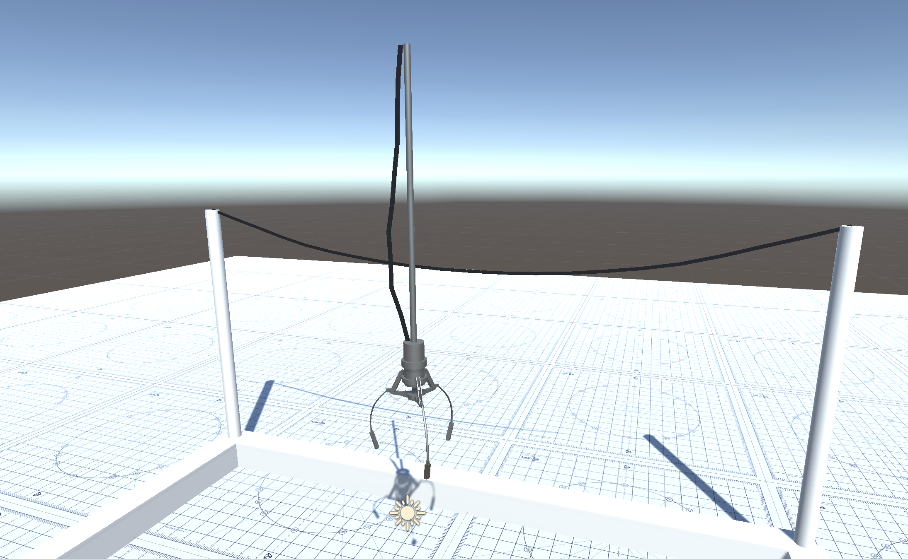

# UnityRopeController

> A simple component generates a rope, rendered as a line, between two GameObjects.



## Install

### Unity Package Manager

<https://docs.unity3d.com/Packages/com.unity.package-manager-ui@2.0/manual/index.html>

#### Git

```json
{
  "dependencies": {
    "com.scottdoxey.unityropecontroller": "https://github.com/neogeek/UnityRopeController.git#v1.0.0",
    ...
  }
}
```

## Setup

1. Create a GameObject with a kinematic `RigidBody` and `LineRenderer` components.
1. Attach the `RopeController` and connect the `RigidBody` to the `Anchor` property and the `LineRenderer` to the `LineRenderer` property.
1. Create a second GameObject with a kinematic `RigidBody`.
1. Attach that `RigidBody` to the `Target` property of the `RopeController` component on the first GameObject.
